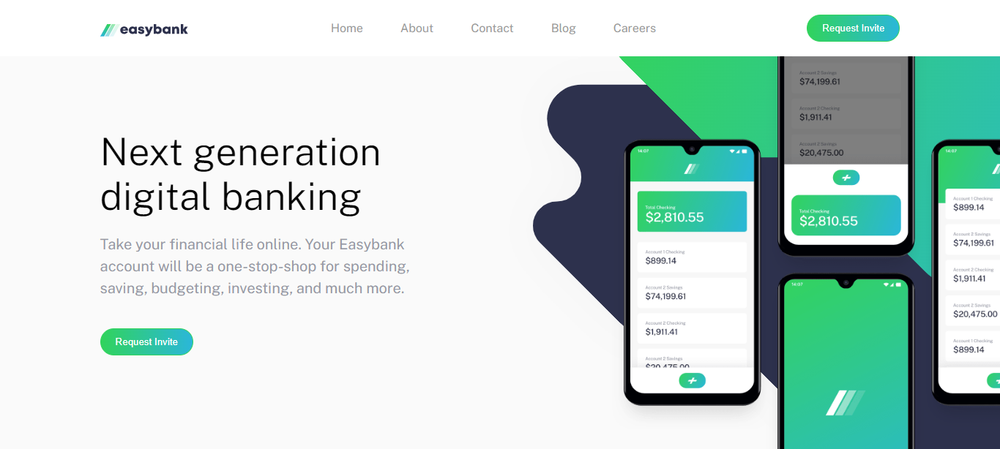

# HTML5 and CSS3 Mini Tasks Repository

Welcome to the HTML5 and CSS3 Mini Tasks Repository! This repository contains a collection of tasks designed to help you kickstart your web development projects. Whether you're building a personal website, a portfolio, or an e-commerce site, you'll find a variety of inspirations and new ideas here to suit your needs.

## Table of Contents

1. [Introduction](#introduction)
2. [Tasks](#tasks)
    - [Task 1](#task-1)
    - [Task 2](#task-2)
    - [Task 3](#task-3)
    - [Task 4](#task-4)
    - [Task 5](#task-5)
3. [Contributing](#contributing)
4. [License](#license)

## Introduction

The HTML5 and CSS3 Mini Tasks Repository provides a multile tasks for web developers and designers. Each task is built using modern HTML5 and CSS3 techniques, ensuring high-quality design and functionality.

## Tasks

### Tasks Navigation

| Template Name | Repository Link                   | Demo Link                                                 |
|---------------|-----------------------------------|-----------------------------------------------------------|
| Task 1        | [Link](HTML5_And_CSS3_Task01)     | [Demo](https://seifabdal-azem.github.io/HTML-CSS-Task01/) |
| Task 2        | [Link](HTML5_And_CSS3_Task02)     | [Demo](https://seifabdal-azem.github.io/HTML-CSS-Task02/) |
| Task 3        | [Link](HTML5_And_CSS3_Task03)     | [Demo](https://seifabdal-azem.github.io/HTML-CSS-Task03/) |
| Task 4        | [Link](HTML5_And_CSS3_Task04)     | [Demo](https://seifabdal-azem.github.io/HTML-CSS-Task04/) |
| Task 5        | [Link](HTML5_And_CSS3_Task05)     | [Demo](https://seifabdal-azem.github.io/HTML-CSS-Task05/) |
| Task 6        | [Link](HTML5_And_CSS3_Task06)     | [Demo](https://seifabdal-azem.github.io/HTML-CSS-Task06/) |

#### Task 1

[Live Demo](https://seifabdal-azem.github.io/HTML-CSS-Task01/)

#### Task 2

[Live Demo](https://seifabdal-azem.github.io/HTML-CSS-Task02/)

### Task 3

[Live Demo](https://seifabdal-azem.github.io/HTML-CSS-Task03/)

### Task 4

[Live Demo](https://seifabdal-azem.github.io/HTML-CSS-Task04/)

### Task 5

[Live Demo](https://seifabdal-azem.github.io/HTML-CSS-Task05/)

### Task 6

[Live Demo](https://seifabdal-azem.github.io/HTML-CSS-Task06/)

## Contributing

Contributions to this repository are welcome! If you have additional templates to contribute or improvements to existing ones, please follow the guidelines outlined in the [CONTRIBUTING.md](CONTRIBUTING.md) file.

## License

This repository is licensed under the [MIT License](LICENSE). Feel free to use the templates for personal or commercial projects.

Happy coding!
